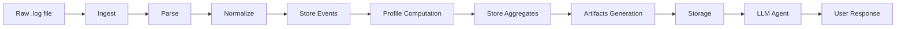

# LogCopilot

`LogCopilot` это monorepo для обработки логов с одним общим ядром, тремя сценариями анализа и агентом, который читает уже обработанные данные, а не сырые логи.

## Что зафиксировано в MVP

- Один запуск принимает ровно один входной файл `.log`.
- Пользователь выбирает один сценарий: `heatmap`, `incidents` или `traffic`.
- Каждый запуск получает свой `run_id`.
- Результат сохраняется в:
  - SQLite: `out/logcopilot.sqlite`
  - файлы: `out/runs/<run_id>/...`

## Сценарии

- `heatmap`: нагрузка, пики, активные модули, qps, p95 latency.
- `incidents`: ошибки, сигнатуры, кластеры, semantic-группы, top incident report.
- `traffic`: endpoint-ы, статусы, IP, latency, подозрительные паттерны.

## Быстрый старт

Установить зависимости:

```bash
python -m pip install -r requirements.txt
python -m pip install -e .
```

Запустить обработку:

```bash
python -m logcopilot.cli run --input data/sample.log --profile incidents --out out
```

Старый incident entrypoint пока оставлен:

```bash
python -m logcopilot.pipeline --input data/sample.log --out out --semantic off
```

Запустить тесты:

```bash
python -m unittest discover -s tests
```




## Что должно появиться на выходе

Общее для любого запуска:

- `manifest.json`
- `run_summary.json`
- `events.csv`
- `events.parquet`, если доступен parquet
- `charts/*.png`, если агент построил визуализацию по вопросу в чате

Для `heatmap`:

- `heatmap_timeseries.csv`
- `top_hotspots.md`

Для `incidents`:

- `clusters.csv`
- `semantic_clusters.csv`
- `top_incidents.md`
- `llm_ready_clusters.json`

Для `traffic`:

- `traffic_summary.csv`
- `latency_report.md`
- `suspicious_traffic.md`

## Структура репозитория

```text
logcopilot/
  core/       общее ядро и сборка Event
  profiles/   heatmap / incidents / traffic
  storage/    SQLite и read API
  agent/      tools и оркестрация агента
docs/
  architecture.md
  contracts.md
  team_workflow.md
  task_briefs/
tests/
```

## Как работаем командой

- Основная ветка: `main`.
- Отдельную `dev` ветку не используем.
- Рабочие ветки:
  - `feature/<scope>`
  - `fix/<scope>`
  - `docs/<scope>`
- Все изменения идут через PR.
- Перед merge должны пройти тесты.

Подробности в [docs/team_workflow.md](docs/team_workflow.md).
Настройка GitHub описана в [docs/github_setup.md](docs/github_setup.md).
