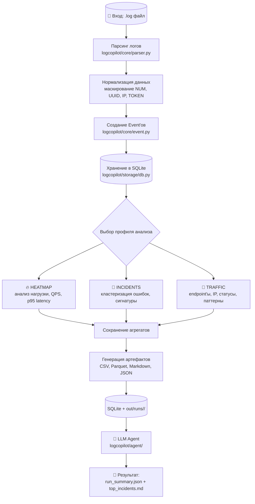
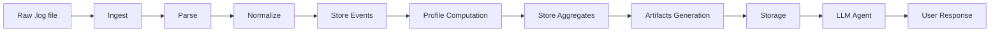
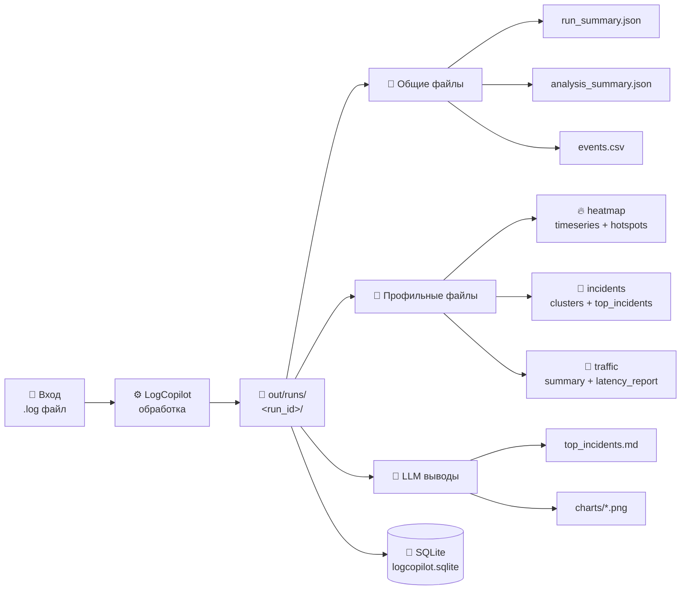
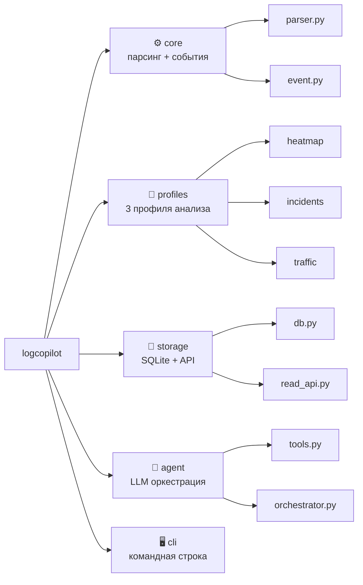

# LogCopilot

`LogCopilot` - инструмент для анализа лог-файлов с поддержкой трёх профилей анализа (heatmap, incidents, traffic) и интеграцией с Yandex LLM для генерации выводов.

## Основные возможности

- 🔍 **Три профиля анализа**: heatmap (нагрузка), incidents (ошибки), traffic (трафик)
- 🤖 **Интеграция с Yandex LLM** для автоматических выводов
- 📊 **Выходные данные**: `run_summary.json` с метриками качества, `findings.json` с выводами
- 💾 **Сохранение результатов** в SQLite и файлы

## Что зафиксировано в MVP

- Один запуск принимает ровно один входной файл `.log`.
- Пользователь выбирает один сценарий: `heatmap`, `incidents` или `traffic`.
- Каждый запуск получает свой `run_id`.
- Результат сохраняется в:
  - SQLite: `out/logcopilot.sqlite`
  - файлы: `out/runs/<run_id>/...`

## Сценарии

- `heatmap`: нагрузка, пики, активные модули, qps, p95 latency.
- `incidents`: ошибки, сигнатуры, кластеры, semantic-группы, top incident report.
- `traffic`: endpoint-ы, статусы, IP, latency, подозрительные паттерны.


## Pipeline Flow 



## Как запускать

Установить зависимости:

```bash
python -m pip install -r requirements.txt
python -m pip install -e .
```

## Команды запуска

### 1. Обычный запуск (без LLM)

```bash
python -m logcopilot.cli run --input data/sample.log --profile traffic --out out
```
### 2. Запуск с Yandex LLM

Требования:

 - Настроить API-ключ Yandex в .env файле или переменных окружения

 - Аккаунт Yandex Cloud с доступом к LLM

```bash
python -m logcopilot.cli run --input data/sample.log --profile incidents --out out --llm yandex
```
### 3. Запуск с отключенной семантикой (--semantic off)

Это режим быстрого анализа без группировки ошибок по смыслу. Работает только статистическая кластеризация.
```bash
python -m logcopilot.pipeline --input data/sample.log --out out --semantic off
```

### Запустить тесты:

```bash
python -m unittest discover -s tests
```





## Что должно появиться на выходе

Общее для любого запуска:

- `manifest.json`
- `run_summary.json`
- `events.csv`
- `events.parquet`, если доступен parquet
- `charts/*.png`, если агент построил визуализацию по вопросу в чате

Для `heatmap`:

- `heatmap_timeseries.csv`
- `top_hotspots.md`

Для `incidents`:

- `clusters.csv`
- `semantic_clusters.csv`
- `top_incidents.md`
- `llm_ready_clusters.json`

Для `traffic`:

- `traffic_summary.csv`
- `latency_report.md`
- `suspicious_traffic.md`


## Детальное описание выходных JSON-файлов

### Файл `run_summary.json` — главный результат запуска

Пример содержимого:

{
  "run_id": "930de4a93fa34cd0b6110d532be7d43c",
  "profile": "incidents",
  "status": "completed",
  "event_count": 23147,
  "profile_fit": {
    "selected_profile": "incidents",
    "recommended_profile": "traffic",
    "selected_score": 0.205,
    "recommended_score": 1.0,
    "fit_label": "low",
    "reason": "selected profile 'incidents' is weaker than 'traffic'"
  },
  "parser_diagnostics": {
    "dominant_parser": "web_access",
    "parse_quality": { "score": 0.982, "label": "high" },
    "incident_signal_quality": { "score": 0.105, "label": "low" }
  }
}

| Поле | Значение |
|------|----------|
| run_id | Уникальный идентификатор запуска |
| profile | Какой профиль был выбран (incidents/heatmap/traffic) |
| status | completed или failed |
| event_count | Количество обработанных событий (строк лога) |
| profile_fit.selected_score | Оценка соответствия выбранного профиля (0-1). Чем выше, тем лучше |
| profile_fit.recommended_profile | Какой профиль рекомендует система |
| profile_fit.fit_label | high / medium / low — насколько профиль подходит |
| parser_diagnostics.parse_quality.label | high / medium / low — качество парсинга логов |
| parser_diagnostics.incident_signal_quality.label | high / medium / low — насколько лог полезен для поиска инцидентов |

### Файл `top_incidents.md` — выводы по инцидентам (findings)

Это главный отчёт с инцидентами в человекочитаемом формате. Содержит топ ошибок и проблем.

Пример содержания:

```markdown
# LogCopilot Top Clusters

- Events: 23147
- Signature clusters: 7075
- Parse quality: high (0.98)
- Incident signal quality: low (0.11)

## Top-10 incidents

### 1. 4a6b905b23f799abc477bbbaab505ddc16bffaf2
- Hits: 48
- First seen: 2016-01-19 00:14:54
- Last seen: 2016-01-20 00:09:04
- Confidence: medium (0.60)
- Sample messages:
  - GET http://login.webofknowledge.com:80/error/WOK5/WoKcommon.css
```

| Секция | Что показывает |
|------|----------|
| Parse quality | Насколько хорошо распарсились логи (high/medium/low) |
| Incident signal quality | Насколько логи полезны для поиска инцидентов |
| Signature clusters | Количество уникальных сигнатур ошибок |
| Hits | Сколько раз встретилась ошибка |
| Confidence | Уверенность, что это действительно инцидент (high/medium/low) |
| Sample messages | Примеры сообщений об ошибке |


## Output Contract — что получает пользователь




## Структура репозитория

```text
logcopilot/
  core/       общее ядро и сборка Event
  profiles/   heatmap / incidents / traffic
  storage/    SQLite и read API
  agent/      tools и оркестрация агента
docs/
  architecture.md
  contracts.md
  team_workflow.md
  task_briefs/
tests/
```

## Структура модулей проекта




## Как работаем командой

- Основная ветка: `main`.
- Отдельную `dev` ветку не используем.
- Рабочие ветки:
  - `feature/<scope>`
  - `fix/<scope>`
  - `docs/<scope>`
- Все изменения идут через PR.
- Перед merge должны пройти тесты.

Подробности в [docs/team_workflow.md](docs/team_workflow.md).
Настройка GitHub описана в [docs/github_setup.md](docs/github_setup.md).
